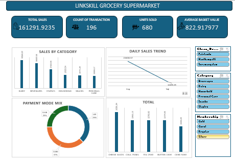

# 🛒 Grocery Supermarket Sales Analysis

Grocery Supermarket Sales Analysis using Microsoft Excel. Analyzed 196 transactions to identify sales trends, top-performing categories and products, payment preferences, branch performance, and key KPIs. Built Pivot Tables, charts, dashboard, and business insights to support data-driven decisions.

## 📊 Project Overview

This project is a **Grocery Supermarket Sales Analysis** created as a data analytics mini-capstone project.

The objective of this project is to analyze supermarket transaction data and generate meaningful business insights related to **sales, products, categories, branches, payment methods, customers, and overall business performance**.

The project uses Microsoft Excel to clean, analyze, summarize, and visualize the supermarket sales data through **Pivot Tables, KPIs, Dashboard analysis, and Business Insights**.

---

## 🎯 Project Objectives

The main objectives of this project are:

* Analyze overall supermarket sales performance
* Identify the highest-performing product categories
* Identify top-selling products
* Analyze sales by month
* Analyze payment method preferences
* Track total transactions and units sold
* Calculate average basket value
* Compare branch performance
* Generate actionable business insights
* Create an interactive and easy-to-understand dashboard
---

## 🗂️ Dataset

The dataset contains supermarket transaction, product, and customer information.
[Download Dataset](https://github.com/anjutha09/Grocery-Supermarket-Sales-Analysis/blob/main/Grocery_Supermarket_Mini_Capstone_Dataset.xlsx)

### Sales Data

The `Sales_Raw` sheet contains transaction-level information such as:

* Transaction ID
* Sale Date
* Customer ID
* Product ID
* Quantity
* Unit Price
* Discount Percentage
* Payment Mode
* Branch
* Cashier
* Category
* Product Name
* Brand
* Cost Price
* MRP
* Supplier
* Customer Name
* Gender
* Age
* City
* Membership
* Join Date
* Gross Sales
* Net Sales
* Profit

### Product Master

The `Products_Master` sheet contains:

* Product ID
* Product Name
* Category
* Brand
* Cost Price
* MRP
* Supplier

### Customer Master

The `Customers_Master` sheet contains:

* Customer ID
* Customer Name
* Gender
* Age
* City
* Membership
* Join Date

---

## 📈 Key Performance Indicators

The analysis calculates important supermarket KPIs including:

| KPI                      |      Result |
| ------------------------ | ----------: |
| 💰 Total Sales           | ₹161,291.92 |
| 🧾 Total Transactions    |         196 |
| 📦 Units Sold            |         680 |
| 🛍️ Average Basket Value |     ₹822.92 |

---

## 🔎 Analysis Performed

### 1. Category Analysis

Sales were analyzed across different product categories, including:

* Dairy
* Beverages
* Staples
* Household
* Snacks
* Personal Care

The analysis helps identify which categories contribute the most to total revenue.

### 2. Monthly Sales Analysis

Sales were analyzed across months to understand sales trends and identify stronger and weaker periods.

### 3. Payment Method Analysis

Customer payment preferences were analyzed using:

* UPI
* Card
* Cash

This helps understand the most commonly used payment methods.

### 4. Product Analysis

Products were ranked based on sales contribution to identify high-performing products.

### 5. Branch Analysis

Sales performance was analyzed across supermarket branches to identify stronger-performing locations.

### 6. Customer Analysis

Customer information such as:

* Gender
* Age
* City
* Membership type

can be used to understand customer characteristics and purchasing behavior.

---

## 📊 Dashboard

#The dashboard focuses on:

* Total Sales
* Total Transactions
* Units Sold
* Average Basket Value
* Category Performance
* Product Performance
* Monthly Sales
* Payment Method Analysis
* Branch Performance
  

[🔗 View Dashboard Image](./Dashboard.png)

---

## 💡 Business Insights

The analysis shows that **Dairy** is the highest-selling category based on the available sales analysis.

Payment-method analysis shows that **UPI and Card contribute significant portions of sales**, while Cash also contributes to overall revenue.

The product-level analysis can be used to identify products with particularly strong sales performance and support inventory and promotional decisions.

---

## 🛠️ Tools & Technologies

* **Microsoft Excel**
* Excel Tables
* Pivot Tables
* Pivot Charts
* Excel Dashboard
* Data Cleaning
* Data Analysis
* KPI Analysis
* Business Intelligence
* Data Visualization

---

## 📌 Key Learning Outcomes

Through this project, I practiced:

* Data cleaning
* Excel formulas
* Data validation
* Pivot Tables
* Pivot Charts
* KPI creation
* Sales analysis
* Customer analysis
* Product analysis
* Business insights
* Dashboard development
* Data storytelling

---

## 👩‍💻 Author

**Anjutha B**

Aspiring Data Analyst | Excel | SQL | Power BI | Data Analytics

---

## ⭐ Project Highlights

This project demonstrates how raw supermarket transaction data can be transformed into **meaningful business information and actionable insights using Microsoft Excel**.

If you found this project useful, feel free to ⭐ the repository.
